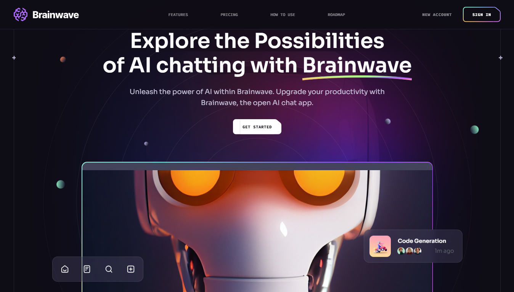

# Brainwave 🌐 

**Brainwave** is a modern UI/UX website designed with **React.js** and **Tailwind CSS**, showcasing cutting-edge design principles. Its sleek interface, seamless animations, and exceptional user experience make it a benchmark for modern web applications.  

 

## 🌐 Demo  

Experience the live demo here: [Brainwave Live Demo](https://brainwave-js.netlify.app/) 

## ⚙️ Tech Stack  
- **Vite**: Lightning-fast build tool for modern web development  
- **React.js**: A declarative, component-based JavaScript library for building user interfaces  
- **Tailwind CSS**: A utility-first CSS framework for fast and responsive design  

---

## 🔋 Features  

### ✨ Stunning Design  
- **Hero Section**: Captivating first impression  
- **Services & Features**: Highlights offerings in an intuitive layout  
- **How to Use & Roadmap**: Guides users and provides a timeline  
- **Pricing**: Comprehensive plans for potential users  
- **Footer & Header**: Clean, functional navigation and contact options  

### 🚀 Dynamic Animations  
- **Parallax Effects**: Engaging mouse and scroll-triggered animations  
- **Modern UI Trends**: Inspired by bento grids and sleek geometries  

### 🎨 Enhanced Visuals  
- **Complex UI Geometry**: Features circular displays, grid lines, and creative sidebars  
- **Gradients**: Beautiful gradients for cards, buttons, and sections  

### 🌟 Fully Responsive  
- Optimized for all screen sizes and devices  

### ♻️ Code Excellence  
- Clean architecture for scalability  
- Highly reusable components  

---

## 🤸 Quick Start  

Follow these steps to set up Brainwave locally:  

### Prerequisites  
Ensure the following are installed on your machine:  
- **Git**  
- **Node.js**  
- **npm**  

### Installation  
1. Clone the repository:  
```bash  
git clone https://github.com/MohammedJawwad/Brainwave.git  
cd Brainwave
```  
2. Install dependencies:
```bash
npm install
```
3. Start the development server:
```bash
npm run dev
```

## 📂 Project Structure
brainwave/
├── public/          # Static assets  
├── src/  
│   ├── components/  # Reusable UI components  
│   ├── pages/       # Main website pages  
│   ├── styles/      # Tailwind CSS configurations  
│   └── App.jsx      # Root React component  
└── vite.config.js   # Vite configuration  

## 📄 License  

This project is licensed under the [MIT License](./LICENSE).  

